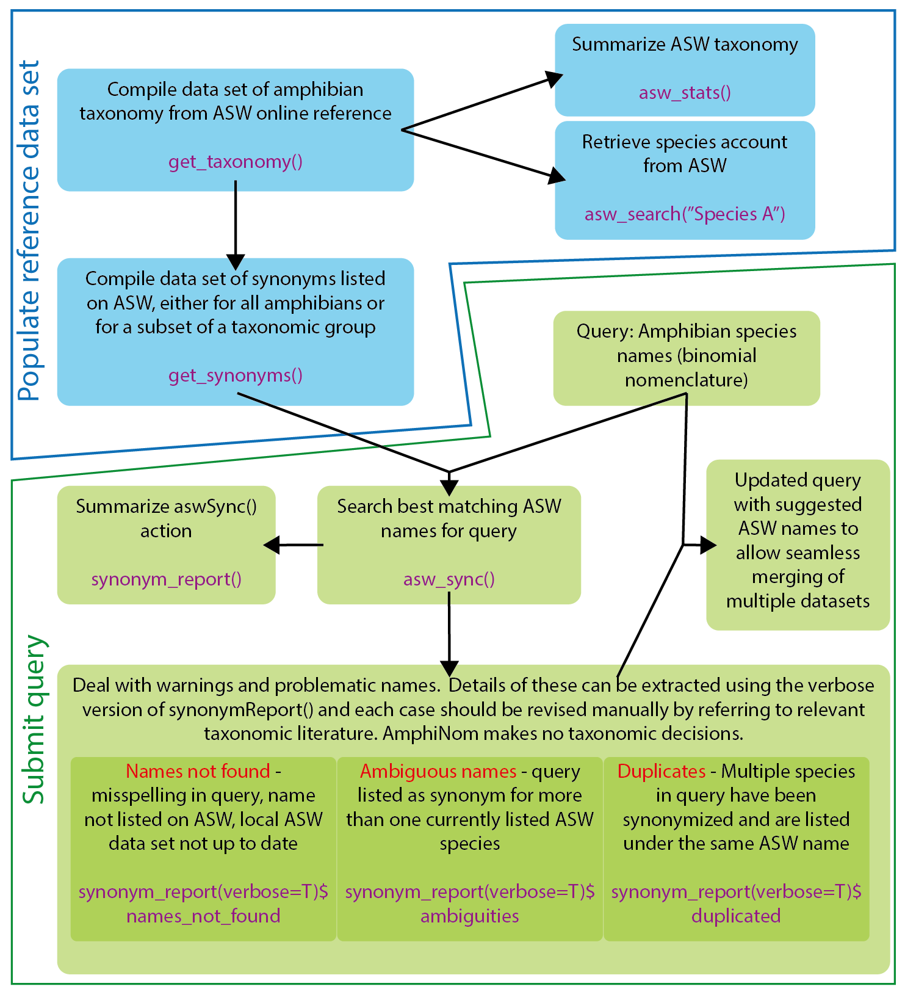

# AmphiNom

This package is designed to simplify the workflow of combining amphibian data sets from sources that use different taxonomic nomenclature (AmphiNom: Amphibian Nomenclature), by conforming to the most current system suggested by the [Amphibian Species of the World](https://amphibiansoftheworld.amnh.org/). Comparative studies require the combination of data from a range of sources such as spatial or conservation data from the [IUCN red list](http://www.iucnredlist.org/), information on evolutionary history from published phylogenies such as [Pyron 2014, Syst Biol](https://doi.org/10.1093/sysbio/syu042) or life history data from [AnAge](http://genomics.senescence.info/species/). These sources have either made the decision to follow a specific taxonomic system or, more often, are no longer up-to-date. It can therefore be complicated to establish a universal or current nomenclature to be able to efficientlty combine data sets. As such, the main objective of this package is to harvest taxonomic classifications of all amphibian species listed on the ASW website, harvest all listed synonyms per species and then using this information, suggest ASW names for any given list of taxa.

This package could also be useful for easily updating museum catalogs etc., and includes functions for producing summary statistics on species numbers at various taxonomic levels, or to update species names in manuscripts etc. after a taxonomic group has received nomenclature revisions.

Good places to start learning more about AmphiNom is this [Tutorial](https://hcliedtke.github.io/R-scrapheap/amphinom_tutorial.html) and this worked [Example](https://figshare.com/articles/dataset/AmphiNom_an_amphibian_systematics_tool/7235297). **NOTE: the function names have been updated for version v1.1.0)**

This schametic is intended to outline how to use the functions of this package:



## Package Installation

You can install AmphiNom in R directly using devtools:

```{r}
library(devtools)
install_github("hcliedtke/AmphiNom", build_vignettes = FALSE)
library(AmphiNom)
```

(The installation may crash if your dependencies are not up to date, or if you choose to build the vignettes)

## HTTP 403

Some websites don't like to be scraped.There are three functions that crawl the ASW website (`getTaxonomy()`,`getSynonyms()` and `aswSearch()`). It may be that the server will deny access (HTTP stattus 403), especially after repeated requests have been made. Nonetheless, AmphiNom can still be used with the internally stored dataset.

This may also cause installing the packages with vignettes to fail. If this is the case, make sure to disable these while installing (`build_vignettes = FALSE`). Versions of vignettes and tutorials can be accessed [here](https://hcliedtke.github.io/R-scrapheap/amphinom_example.html) and [here](https://hcliedtke.github.io/R-scrapheap/amphinom_tutorial.html). __NOTE:__ The latest version of AmphiNom has slightly different grammer (asw_sync() instead of aswSync() etc.).

## Internal datasets

Last updated on 9th September 2024

## Package citation

H. Christoph Liedtke (2019). AmphiNom: an amphibian systematics tool. Systematics and Biodiversity (17)1:1-6
